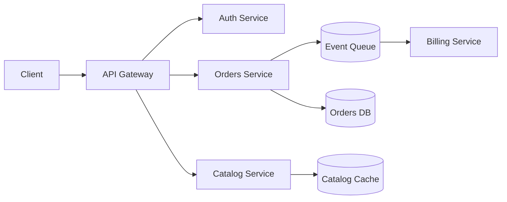

A high-level view of how a request flows from the edge into our core services, for anyone trying
to orient themselves before diving into a specific service's own docs.

The gateway terminates TLS and handles authn/z before routing to internal services over the
service mesh (see ADR-004). Orders publishes events onto the shared queue rather than calling
Billing synchronously, which is what lets Billing be down without blocking checkout.

Each box in this diagram links to its own service README in the core-services repo, which covers
on-call ownership, SLOs, and deploy cadence — this page intentionally stays at the "how it fits
together" level rather than per-service detail.
