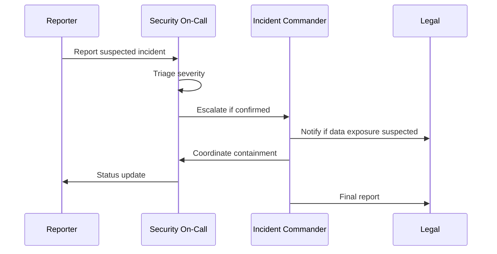

# Escalation Flow

How a suspected security incident moves from first report to resolution. This is distinct from
the platform team's general **Incident Response** runbook — use this flow specifically for
anything involving unauthorized access, data exposure, or suspected compromise.

Report suspected incidents to `#security-oncall`, not the general `#incidents` channel — security
incidents have separate handling requirements around evidence preservation that the general
incident process doesn't cover.

Never attempt to contain a suspected compromise yourself before Security On-Call has triaged it;
premature action (like killing a process or rotating a credential) can destroy evidence needed for
the investigation.
